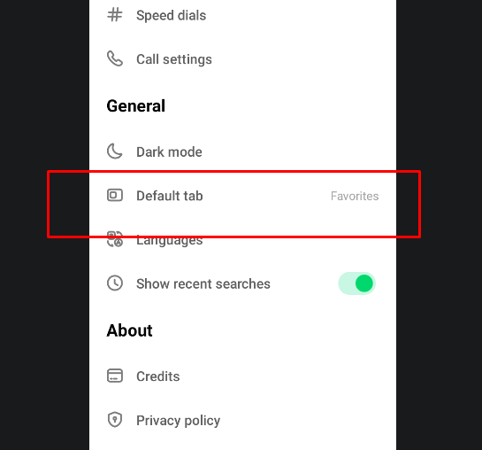
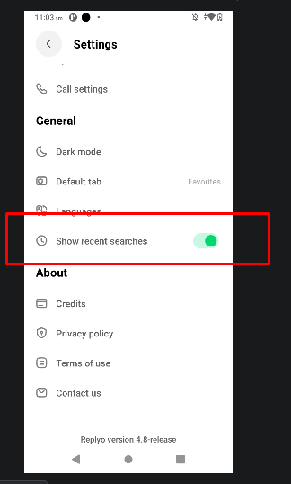
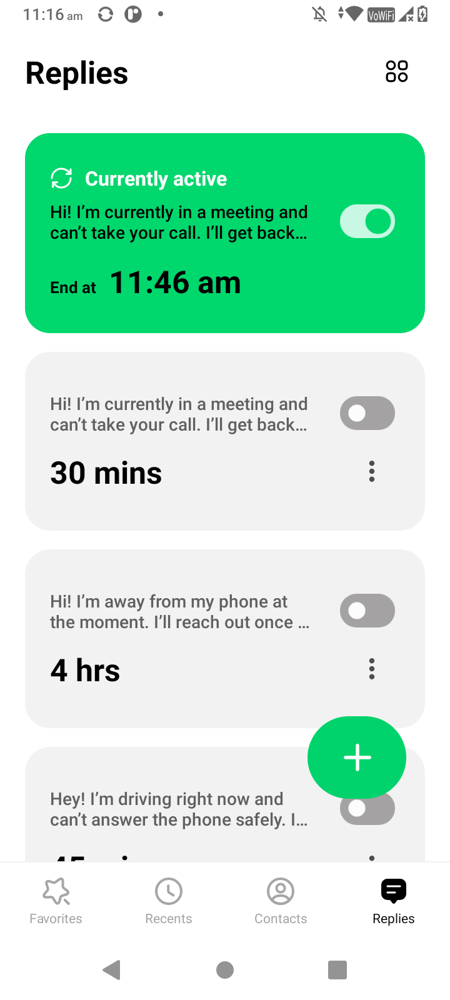
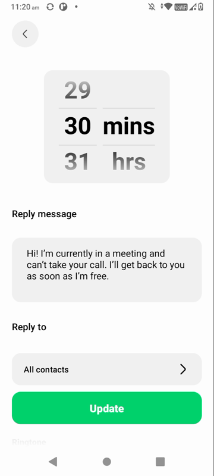
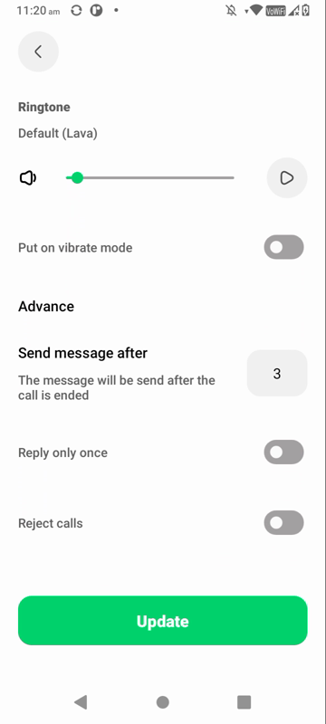
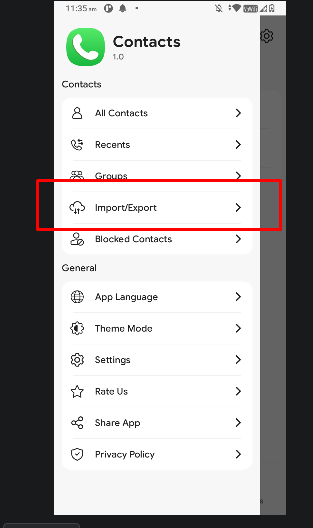
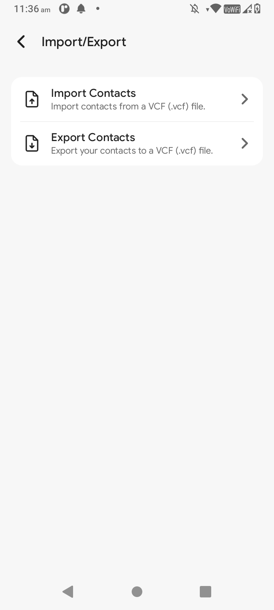
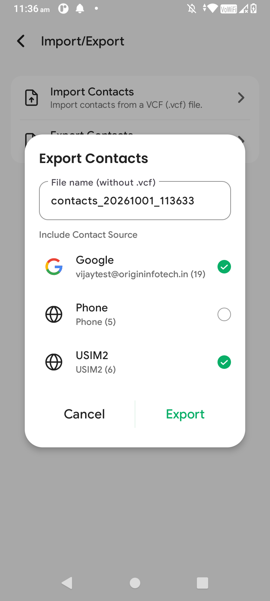
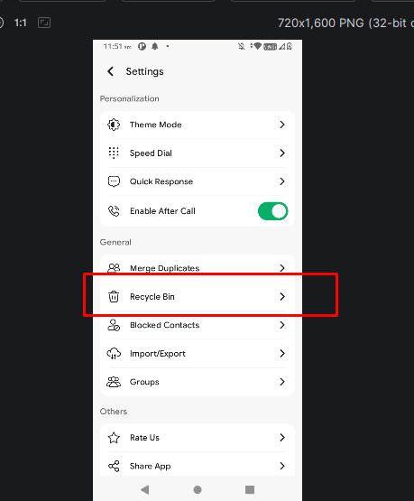
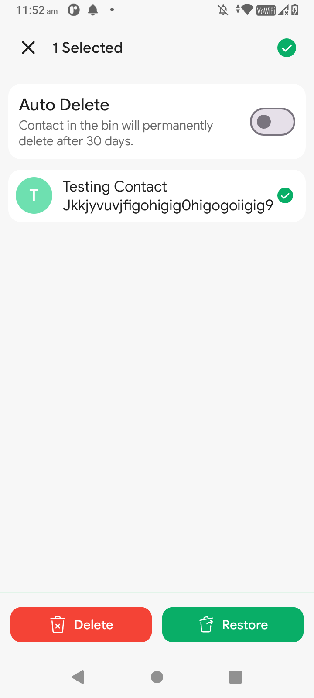

<h1 align="center">🔬 R & D: Feature Research</h1>

<p align="center">
  <i>Features from other apps that we could bring into ours, explained simply with screenshots.</i>
</p>

<p align="center">
  <a href="https://ravioriginfo.github.io/dialer-rnd/"><b>🌐 View the website ↗</b></a>
  <br>
  <sub><a href="https://ravioriginfo.github.io/dialer-rnd/">ravioriginfo.github.io/dialer-rnd</a></sub>
</p>

---

## 👋 Start Here

This note collects **useful features from other phone/contacts apps**. For each one you'll find:

| | |
|---|---|
| 💡 **The idea** | What the feature does, in one sentence |
| 🧑 **Real-life example** | When someone would actually use it |
| 👉 **How to find it** | The taps it takes to get there |
| 📸 **Screenshots** | What it looks like |
| 🛠️ **For developers** | Technical notes, collapsed so it doesn't get in the way |

### 📱 Apps we looked at

| App | Features | Link |
|-----|----------|------|
| 💬 **Replyo** (v4.8) | 1 · 2 · 3 · 4 | [Play Store ↗](https://play.google.com/store/apps/details?id=com.replyo&hl=en_IN) ⚠️ |
| 📞 **Goodwy Dialer** | 5 · 6 | [Play Store ↗](https://play.google.com/store/apps/details?id=com.goodwy.dialer&hl=en_IN) |

> ⚠️ Replyo may no longer be on Google Play (some sites say it was removed in June 2024). If the link doesn't open, search for **"Replyo: Dialer with Auto-reply"** (app ID `com.replyo`).

---

## 🗂️ All Features at a Glance

| # | Feature | In plain words | Where |
|:-:|---------|----------------|-------|
| 1 | [⭐ Default Tab](#f1) | Choose which screen opens first | ⚙️ Settings |
| 2 | [🕘 Recent Searches](#f2) | Show or hide what you searched before | ⚙️ Settings |
| 3 | [💬 Auto Replies](#f3) | Send a text automatically when you're busy | 💬 Replies tab |
| 4 | [📞 Call Handling](#f4) | Choose exactly how busy-mode handles calls | 💬 Replies tab |
| 5 | [📇 Import / Export Contacts](#f5) | Back up or move your contacts | ☰ Side menu |
| 6 | [🗑️ Recycle Bin](#f6) | Get back contacts you deleted by mistake | ⚙️ Settings |

---

# ⚙️ Settings

<a id="f1"></a>

## 1️⃣ ⭐ Default Tab

> 💡 **The idea:** Pick which screen you see first when you open the app.

🧑 **Real-life example:** You mostly call the same 5 people, so you set **Favorites** as the first screen and skip a tap every time.

👉 **How to find it:** `Settings` → `General` → `Default tab`

📱 **Seen in:** [Replyo ↗](https://play.google.com/store/apps/details?id=com.replyo&hl=en_IN)

<p align="center">
  
</p>

- ✅ Shows your current choice on the right (e.g. *Favorites*)
- ✅ Tap it to pick a different tab

---

<a id="f2"></a>

## 2️⃣ 🕘 Show Recent Searches

> 💡 **The idea:** One switch that shows or hides the people you searched for recently.

🧑 **Real-life example:** You searched for "Mom" a minute ago. Next time she's waiting at the top, with no typing needed. Prefer privacy? Turn it off.

👉 **How to find it:** `Settings` → `General` → `Show recent searches`

📱 **Seen in:** [Replyo ↗](https://play.google.com/store/apps/details?id=com.replyo&hl=en_IN)

<p align="center">
  
</p>

- 🟢 **On:** recent searches are shown
- ⚪ **Off:** search starts empty every time

---

# 💬 Busy Mode (Auto Replies)

<a id="f3"></a>

## 3️⃣ 💬 Auto Replies

> 💡 **The idea:** Save ready-made "I'm busy" messages. Turn one on, and anyone who calls you gets that text automatically.

🧑 **Real-life example:** You're walking into a meeting. One tap, and for the next 30 minutes every caller gets *"I'm in a meeting, I'll call you back."*

👉 **How to find it:** Bottom bar → `Replies`

📱 **Seen in:** [Replyo ↗](https://play.google.com/store/apps/details?id=com.replyo&hl=en_IN)

<p align="center">
  
</p>

**What you see on the screen:**

| Looks like | Means |
|------------|-------|
| 🟩 **Green card: "Currently active"** | The reply that's on now, and the time it turns off (e.g. *End at 11:46 am*) |
| ⬜ **Grey cards** | Your other saved replies with their time (`30 mins`, `4 hrs`, `45 mins`) |
| 🔘 **Switch on each card** | Turn that reply on or off |
| ⋮ **Three dots** | Edit or delete it |
| ➕ **Green plus button** | Make a new reply |

**Ready-made messages in the app:**
- 🤝 *"Hi! I'm currently in a meeting and can't take your call…"*
- 📵 *"Hi! I'm away from my phone at the moment…"*
- 🚗 *"Hey! I'm driving right now and can't answer the phone safely…"*

---

<a id="f4"></a>

## 4️⃣ 📞 Call Handling (Edit a Reply)

> 💡 **The idea:** Tap any reply card to set it up just how you like: **how long**, **what it says**, **who gets it**, **how your phone rings**, and **whether calls get through at all**.

🧑 **Real-life example:** In a meeting you want silence. Turn on **Reject calls** so the phone doesn't ring at all, and callers still get your message.

👉 **How to find it:** `Replies` → tap any reply card

📱 **Seen in:** [Replyo ↗](https://play.google.com/store/apps/details?id=com.replyo&hl=en_IN)

<p align="center">
  
  &nbsp;&nbsp;&nbsp;
  
</p>
<p align="center"><sub>⬅️ Top of the screen &nbsp;·&nbsp; Bottom of the screen ➡️</sub></p>

### 🎛️ Every option, explained

| | Option | What it does for you |
|:-:|--------|----------------------|
| ⏱️ | **How long** | Scroll to choose minutes or hours (e.g. *30 mins*). The reply turns off by itself afterwards. |
| ✉️ | **Reply message** | The text your caller gets. Write anything you like. |
| 👥 | **Reply to** | Who gets the message. Normally **all contacts**. |
| 🔔 | **Ringtone** | Choose the ringtone and volume while busy, and ▶️ to hear it first. |
| 📳 | **Vibrate mode** | Phone buzzes instead of ringing. |
| ⏳ | **Send message after** | Waits a little (e.g. `3`) after the call ends, then sends the text. |
| 1️⃣ | **Reply only once** | If someone calls 5 times, they get the text only **once**, not 5 times. |
| 🚫 | **Reject calls** | Calls are hung up automatically, so the phone stays quiet. They still get your text. |
| 💾 | **Update** | Saves your changes. |

### 🔄 What happens, step by step

| Step | |
|:-:|---|
| 1️⃣ | You switch a reply **on**, and the card turns 🟩 green with an end time |
| 2️⃣ | Someone calls 📞 |
| 3️⃣ | The phone either 🚫 rejects it, or rings your way (🔔 / 📳) |
| 4️⃣ | After the call, they get your ✉️ message |
| 5️⃣ | When the time is up ⏱️, busy mode turns itself **off** |

### 🎬 Watch it


> ▶️ Video not playing? [Open it directly](assets/CallHandle.mp4)

<details>
<summary>🛠️ <b>For developers: open questions</b></summary>

<br>

```
Reply ON → card "Currently active · End at <now + duration>"
Incoming call
  ├─ caller not in "Reply to" list → normal call
  └─ caller in list
       ├─ Reject calls ON  → decline call
       └─ Reject calls OFF → ring with custom ringtone / volume / vibrate
Call ends → wait "Send message after" → send SMS
  (skip if "Reply only once" ON and already sent to this caller)
Duration over → reply OFF
```

- [ ] **Send message after**: is `3` in seconds or minutes?
- [ ] **Reply to**: what choices does it offer (all / chosen contacts / unknown numbers)?
- [ ] Sent as SMS only, or WhatsApp too? Needs the `SEND_SMS` permission.
- [ ] Can more than one reply be on at once?
- [ ] What does the grid icon (top-right of Replies) do?
- [ ] Do ringtone and vibrate change the **system** ringer, or only the app's own ringing?

</details>

---

# 📇 Contacts

<a id="f5"></a>

## 5️⃣ 📇 Import / Export Contacts

> 💡 **The idea:** Save all your contacts into **one small file**, or load contacts back from that file.

🧑 **Real-life example:** You're getting a new phone 📱➡️📱. Export your contacts on the old one, send the file to yourself, then import it on the new phone, and everyone's back.

👉 **How to find it:** `☰ Side menu` → `Import/Export`

📱 **Seen in:** [Goodwy Dialer ↗](https://play.google.com/store/apps/details?id=com.goodwy.dialer&hl=en_IN)

<p align="center">
  
  &nbsp;&nbsp;&nbsp;
  
</p>
<p align="center"><sub>⬅️ Find it in the side menu &nbsp;·&nbsp; Choose Import or Export ➡️</sub></p>

### 🔀 Two choices

| | Option | What it does |
|:-:|--------|--------------|
| ⬆️ | **Import Contacts** | Pick a contacts file (`.vcf`) and add everyone in it to your phone |
| ⬇️ | **Export Contacts** | Save your contacts into a `.vcf` file you can keep or share |

> 📄 **What's a `.vcf` file?** A standard "contacts file" that almost every phone and email app can open, like a digital address book in one file.

### ⬇️ When you tap Export

<p align="center">
  
</p>

| | Option | What it does for you |
|:-:|--------|----------------------|
| 📝 | **File name** | Filled in for you with today's date and time (e.g. `contacts_20261001_113633`), so every backup gets its own name. You can change it. |
| ☑️ | **Include Contact Source** | Tick where to take contacts from. Each one shows **how many** contacts it has. |
| | ↳ 🟦 **Google** (19) | Contacts saved in your Google account |
| | ↳ 📱 **Phone** (5) | Contacts saved only on this phone |
| | ↳ 💳 **SIM card** (6) | Contacts saved on the SIM |
| ✅ | **Export** | Creates the file |

<details>
<summary>🛠️ <b>For developers: open questions</b></summary>

<br>

```
Side menu → Import/Export
  ├─ Import → pick .vcf → parse → insert into ContactsContract
  └─ Export → dialog (file name: contacts_YYYYMMDD_HHMMSS + account checkboxes)
             → write .vcf → save
```

- [ ] **Import**: does it ask which account to save into (Google / Phone / SIM)?
- [ ] **Import**: how are duplicates handled (skip, merge or add twice)?
- [ ] **Export**: where is the file saved? Does the Storage Access Framework picker open, or does it go straight to Downloads?
- [ ] Is there a **Share** option after export?
- [ ] Which details are exported (photo, email, address, notes), or only name and number?
- [ ] Is a progress bar shown for big contact lists?
- [ ] Permissions: `READ_CONTACTS` for export, `WRITE_CONTACTS` for import.

</details>

---

<a id="f6"></a>

## 6️⃣ 🗑️ Recycle Bin (Deleted Contacts)

> 💡 **The idea:** Deleted contacts aren't gone right away. They go to a **Recycle Bin** first, so you can **bring them back** if you change your mind, just like the trash on a computer.

🧑 **Real-life example:** You're cleaning up your contacts and delete "Ravi Plumber" by mistake 😬. Open the Recycle Bin, tap **Restore**, and Ravi is back with his number.

👉 **How to find it:** `Settings` → `General` → `Recycle Bin`

📱 **Seen in:** [Goodwy Dialer ↗](https://play.google.com/store/apps/details?id=com.goodwy.dialer&hl=en_IN)

<p align="center">
  
  &nbsp;&nbsp;&nbsp;
  
</p>
<p align="center"><sub>⬅️ Find it in Settings &nbsp;·&nbsp; Select contacts, then Restore or Delete ➡️</sub></p>

### 🎛️ What you see in the bin

| | Option | What it does for you |
|:-:|--------|----------------------|
| ⏳ | **Auto Delete** switch | When **on**, contacts in the bin are **removed for good after 30 days**, so the bin cleans itself. When **off**, they stay until you remove them. |
| 👤 | **Deleted contacts list** | Every contact you deleted, with its name and number |
| ☑️ | **Tap to select** | Pick one or more contacts. The top bar shows how many (e.g. *1 Selected*). |
| ✅ | **Tick at top-right** | Select **all** contacts at once |
| ❌ | **X at top-left** | Cancel the selection |
| 🟥 | **Delete** (red) | Remove the selected contacts **forever**. ⚠️ This can't be undone. |
| 🟩 | **Restore** (green) | Put the selected contacts **back** in your contacts |

### 🔄 The life of a deleted contact

| Step | |
|:-:|---|
| 1️⃣ | You delete a contact, and it moves to 🗑️ the **Recycle Bin** (not gone yet) |
| 2️⃣ | Changed your mind? Select it → 🟩 **Restore**, and it's back |
| 3️⃣ | Sure you don't need it? Select it → 🟥 **Delete**, and it's gone forever |
| 4️⃣ | Forgot about it? With ⏳ **Auto Delete** on, it's removed after **30 days** |

<details>
<summary>🛠️ <b>For developers: open questions</b></summary>

<br>

```
Delete contact → copy full contact (name, numbers, email, photo, account) into local DB (bin)
              → delete from ContactsContract
Recycle Bin screen
  ├─ Restore → re-insert into ContactsContract (same account) → remove from bin
  ├─ Delete  → remove from bin (permanent)
  └─ Auto Delete ON → background job (WorkManager) removes items older than 30 days
```

- [ ] Android has **no system recycle bin** for contacts, so the app must save a full copy (local DB) **before** deleting.
- [ ] Is a contact restored to the **same account** (Google / Phone / SIM) it came from?
- [ ] Is a **"Deleted X days ago"** or **"X days left"** label shown on each item?
- [ ] Does the bin catch contacts deleted **outside** our app (e.g. from Google Contacts)? Probably not.
- [ ] Is there an **Undo** snackbar right after deleting?
- [ ] Is there a confirmation pop-up before permanent **Delete**?
- [ ] Is the 30-day limit fixed, or can the user change it?

</details>

---

## 📁 Files in This Folder

<details>
<summary>Show all screenshots and videos</summary>

<br>

| File | Feature |
|------|---------|
| 🖼️ `default_tab_pref.png` | 1 · Default Tab |
| 🖼️ `recent_search_feature.png` | 2 · Recent Searches |
| 🖼️ `replay_call_handling.png` | 3 · Auto Replies |
| 🎬 `CallHandle.mp4` | 4 · Call Handling (video) |
| 🖼️ `call_handle_edit_top.png` | 4 · Call Handling, top of screen |
| 🖼️ `call_handle_edit_advance.png` | 4 · Call Handling, bottom of screen |
| 🖼️ `import_export_contact.png` | 5 · Import/Export, side menu |
| 🖼️ `imp_exp_screen.png` | 5 · Import/Export, main screen |
| 🖼️ `imp_exp_func.png` | 5 · Import/Export, Export pop-up |
| 🖼️ `recycle_bin_contact.png` | 6 · Recycle Bin, in Settings |
| 🖼️ `recycle_bin_feature_ux.png` | 6 · Recycle Bin, bin screen |

</details>

<p align="center"><sub>📝 Last updated: 1 Oct 2026</sub></p>
